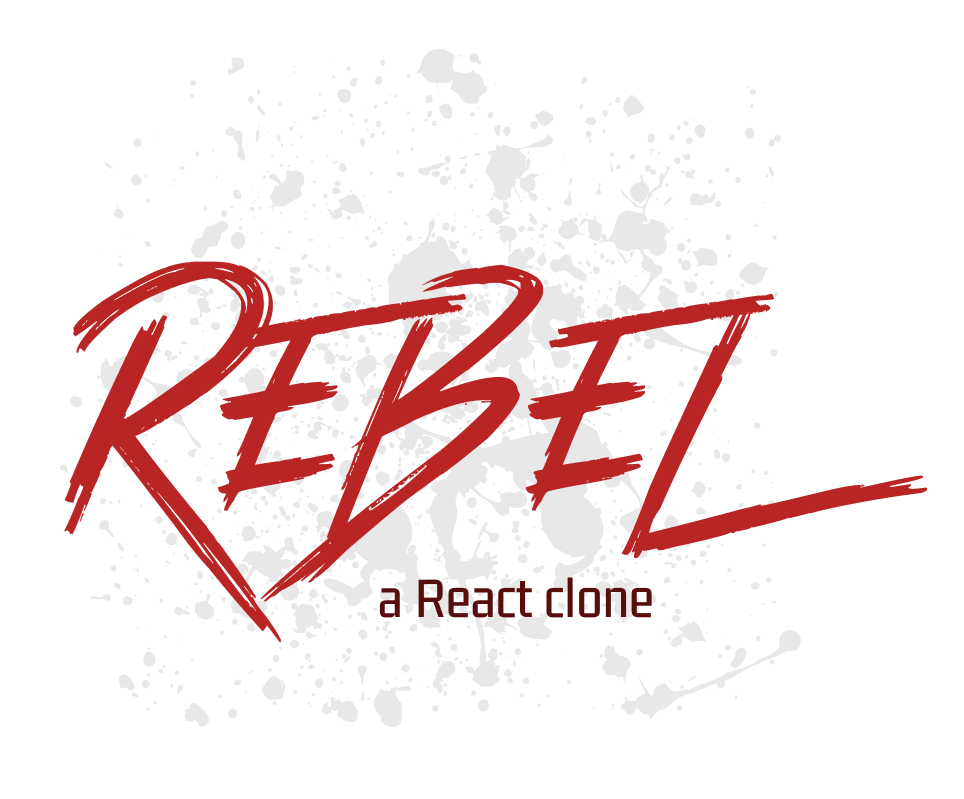

<p align="center">
  
</p>

## What?

Rebel.js is a functional clone of React for my own learning purposes. It does
not seek to be more efficient than React or to add features, it only seeks
to replicate React's API in a way that you could drop-in Rebel and your app
would still function the same.

Hopefully through creating it, I can better understand the inner workings of a
library which is sometimes seen as a bit of black-box magic :)

## Example

You can take any file made for React, and drop in Rebel libraries instead. For
example:

```js
import { useState } from 'rebel'
import { render } from 'rebel-dom'

const Message = ({ count }) => {
  return <div>You've clicked {count} times!</div>
}

const Counter = () => {
  const [count, setCount] = useState(0)

  return (
    <div>
      <Message count={count} />
      <button onClick={() => setCount(count + 1)}>
        Click me!
      </button>
    </div>
  )
}

render(<Counter />, document.getElementById('root'))
```

**Note**: Rebel supports JSX. See [webpack-project](./webpack-project)

---

<h6 align="center">by Adam Soutar</h6>
